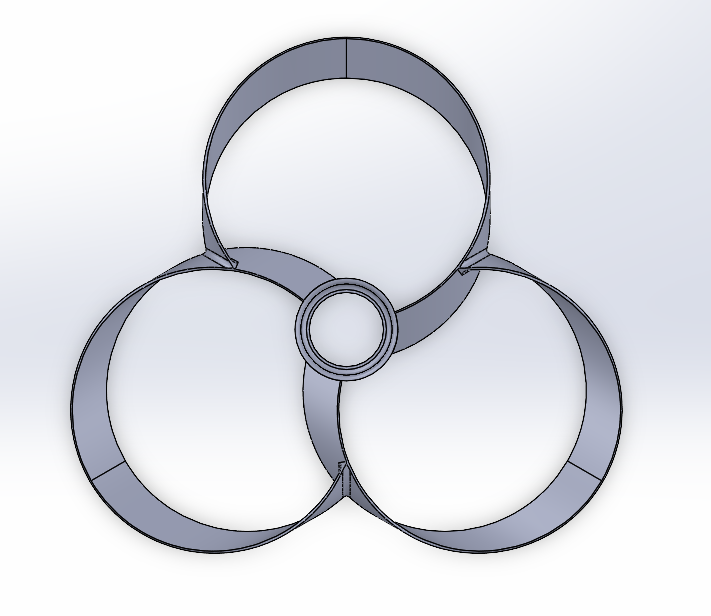
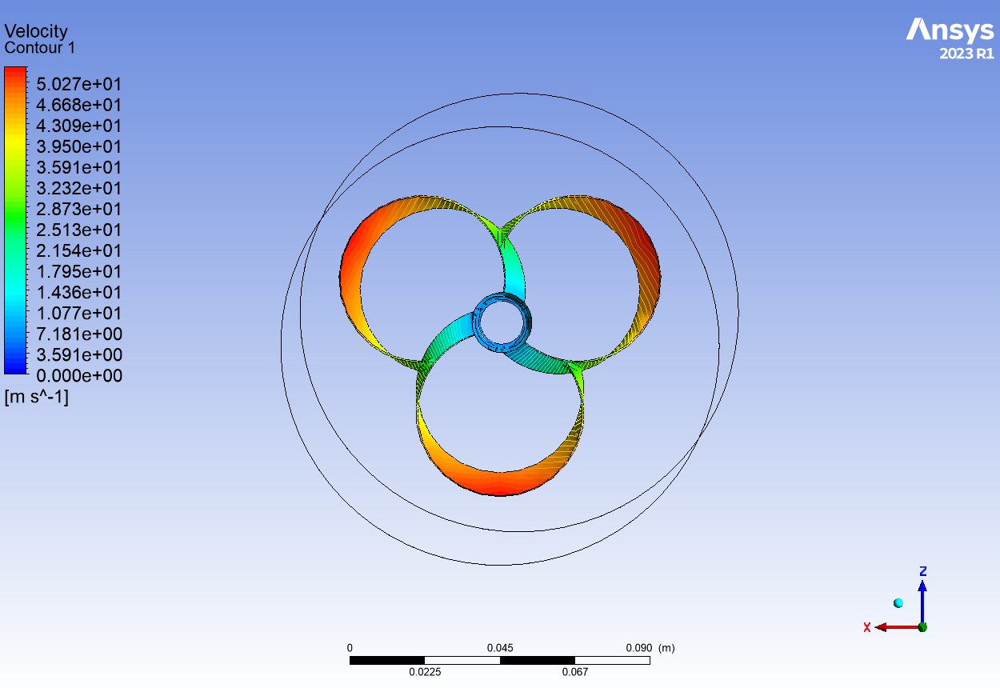
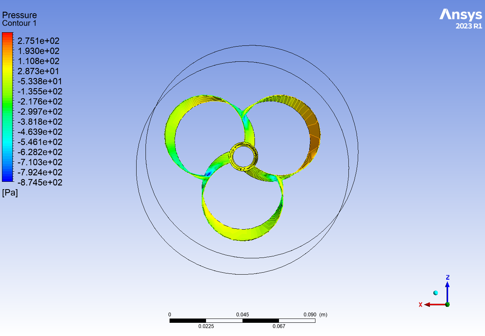
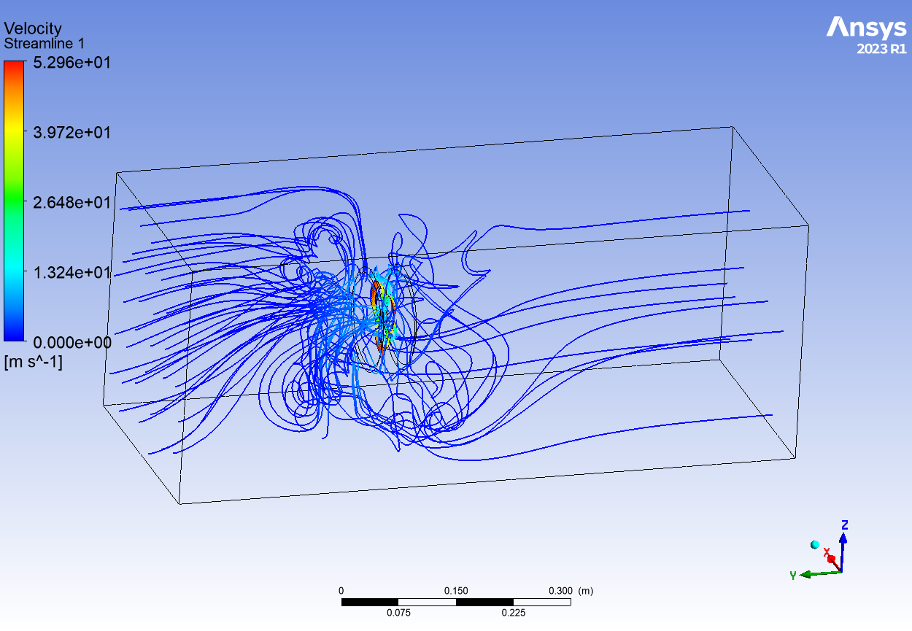

# Transient CFD Analysis of a 3-Bladed Toroidal Propeller

## Project Overview

This project investigates the aerodynamic performance of a 3-bladed toroidal propeller using transient Computational Fluid Dynamics (CFD) simulations in **ANSYS Fluent**. The study evaluates the propeller's thrust, torque, power consumption, surface pressure distribution, and downstream flow-field characteristics under rotating operating conditions.

## Objective

To numerically analyze the aerodynamic performance of a 3-bladed toroidal propeller via transient CFD simulations, specifically quantifying thrust, torque, power, pressure distribution, and velocity-field evolution.

---

## Technical Specifications

| Parameter | Specification / Value |
|---|---|
| **Propeller Type** | Toroidal |
| **Number of Blades** | 3 |
| **Propeller Diameter ($D$)** | 100 mm (0.1 m) |
| **Rotational Speed ($N$)** | 10,000 RPM |
| **Axis of Rotation** | Y-axis |
| **Inlet Velocity ($V_\infty$)** | 0.1 m/s |
| **Working Fluid** | Air ($\rho = 1.225 \text{ kg/m}^3$, $\mu = 1.7894 \times 10^{-5} \text{ kg/m}\cdot\text{s}$) |
| **Domain Type** | External Flow |
| **Simulation Type** | Transient CFD |
| **Turbulence Model** | k-ε Model (Standard / Realizable) |
| **Solver** | ANSYS Fluent (Pressure-Based) |

---

## Geometry & Mesh Setup

### CAD Geometry

* **Design Software:** SolidWorks
* **Configuration:** 3-bladed closed-loop toroidal propeller
* **Aerodynamic Feature:** Continuous loop structure engineered to eliminate sharp blade tips, suppressing localized high-velocity spikes and tip vortices.

### Mesh Specifications

The computational domain utilizes an unstructured grid generated in **ANSYS Meshing**, featuring local refinement along blade edges, wall boundary layers, and the downstream wake region.

| Parameter | Setting / Value |
|---|---|
| **Physics / Solver Preference** | CFD / Fluent |
| **Element Order** | Linear |
| **Global Element Size** | $6.0 \times 10^{-3} \text{ m}$ ($6 \text{ mm}$) |
| **Smoothing** | Medium |
| **Target Skewness** | Default (0.9) |
| **Total Nodes** | 247,344 |
| **Total Elements** | 1,351,455 |

> *Note: Force convergence (Thrust and Torque) was verified across grid density variations to ensure mesh independence.*

---

## Computational Methodology & Boundary Conditions

A 3D unsteady CFD model was established in ANSYS Fluent to analyze the rotating propeller domain:

1. **Stationary Outer Domain:** Captures far-field atmospheric boundary conditions and downstream wake propagation.
   * **Inlet:** Velocity Inlet ($V = 0.1 \text{ m/s}$)
   * **Outlet:** Pressure Outlet ($P_{\text{gauge}} = 0 \text{ Pa}$)
   * **Far-Field:** Stationary Wall
2. **Rotating Inner Domain:** Encloses the propeller geometry using a **Sliding Mesh Model (SMM)** to capture true unsteady rotor rotation.
   * **Propeller Wall:** Moving Wall (No-slip, relative to adjacent cell zone)

### Transient Parameters

| Parameter | Value |
|---|---|
| **Time Step Size ($\Delta t$)** | $1.0 \times 10^{-4} \text{ s}$ |
| **Total Time Steps** | 1000 |
| **Max Iterations / Time Step** | 20 |
| **Reporting Interval** | 1 |

At **10,000 RPM**, one full revolution ($360^\circ$) occurs in **0.006 seconds**. A time step of $\Delta t = 0.0001\text{ s}$ resolves $60^\circ$ of rotation per step, capturing unsteady vortex shedding and flow development across multiple mechanical rotations.

---

## Governing Formulas & Metrics

### 1. Angular Velocity ($\omega$)
$$\omega = \frac{2 \pi N}{60}$$

$$\omega = \frac{2 \pi (10000)}{60} \approx 1047.20 \text{ rad/s}$$

### 2. Axial Thrust ($T$) & Aerodynamic Torque ($Q$)
Total forces and moments integrated along the Y-axis of rotation:
$$T = F_y \quad \text{and} \quad Q = M_y$$

### 3. Shaft Power ($P$)
Calculated from aerodynamic torque and angular velocity:
$$P = Q \cdot \omega$$

### 4. Non-Dimensional Performance Coefficients
Standardized performance coefficients (where $n = \frac{N}{60}$ rev/s):

* **Thrust Coefficient ($C_T$):** $$C_T = \frac{T}{\rho n^2 D^4}$$
* **Torque Coefficient ($C_Q$):** $$C_Q = \frac{Q}{\rho n^2 D^5}$$
* **Power Coefficient ($C_P$):** $$C_P = \frac{P}{\rho n^3 D^5} = 2\pi C_Q$$

---

## Flow-Field Visualizations

### 1. Blade Surface Velocity Distribution

* **Tip Speed Maxima:** Linear velocity peaks at the outermost radii of the toroidal loops at **$52.3 \text{ m/s}$** ($5.027 \times 10^1 \text{ m/s}$), matching $v = \omega r$.
* **Smooth Velocity Gradient:** Velocity transitions from **$0 \text{ m/s}$** near the central hub outward. The closed toroidal structure eliminates sharp blade tips, smoothing localized velocity spikes.

### 2. Surface Static Pressure Contour

* **Pressure Differential ($\Delta P$):** High static pressure up to **$+275.1 \text{ Pa}$** builds on the driving face, while low static pressure drops to **$-874.5 \text{ Pa}$** on the suction side near inner curvature transitions.
* **Thrust Generation:** Integrating this pressure differential ($\Delta P = P_{\text{pressure}} - P_{\text{suction}}$) over the blade area generates the net axial thrust.

### 3. Velocity Streamlines & Wake Structure

* **Downstream Acceleration:** Fluid drawn from the far field (blue streamlines, $\approx 0 - 13.2 \text{ m/s}$) accelerates through the rotor plane to core velocities around **$52.96 \text{ m/s}$**.
* **Vortex Suppression:** The toroidal loop geometry suppresses tip-vortex shedding, confining recirculation primarily around the blade roots.

---

## Final Quantitative Results

### Performance Summary

| Parameter | Final Value |
|---|---:|
| **Propeller Diameter ($D$)** | 100 mm |
| **Number of Blades** | 3 |
| **Rotational Speed ($N$)** | 10,000 RPM |
| **Inlet Velocity ($V_\infty$)** | 0.1 m/s |
| **Thrust ($T$)** | 0.07889 N |
| **Torque ($Q$)** | 0.02571 N·m |
| **Shaft Power ($P$)** | **26.92 W** |

### Shaft Power Calculation

$$P = Q \cdot \omega$$

$$\omega = \frac{2\pi (10000)}{60} \approx 1047.20 \text{ rad/s}$$

$$P = 0.02571 \text{ N}\cdot\text{m} \times 1047.20 \text{ rad/s} \approx \mathbf{26.92 \text{ W}}$$

---

## Key Takeaways

* Successfully evaluated thrust ($0.07889 \text{ N}$), torque ($0.02571 \text{ N}\cdot\text{m}$), and power demand ($26.92 \text{ W}$) for a $100\text{ mm}$ toroidal propeller operating at 10,000 RPM.
* Visualized tip-vortex suppression along the closed loop geometry relative to standard open-ended blades.
* Captured transient pressure distribution and velocity acceleration patterns across multiple mechanical revolutions.

---

## Software Used

* **CAD Modeling:** SolidWorks
* **Meshing:** ANSYS Meshing
* **CFD Solver & Post-Processing:** ANSYS Fluent

---

## Author

**Riya Dewangan**  
*Undergraduate Researcher | CFD & Aerodynamics*
